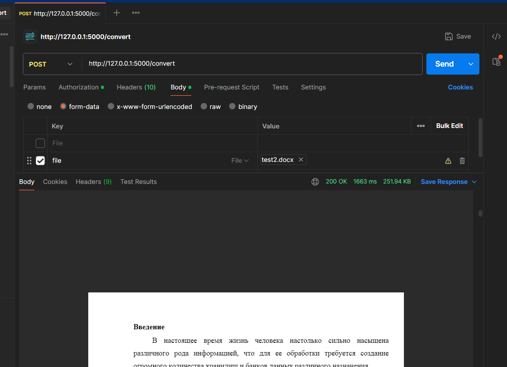

# ConvectorDocxToPDF
ConvectorDocxToPDF
libreService - метод который конвектирует (для удобности)
appLibreOffice - ендпоинт работающий с методом 
1) Установка LibreOffice: https://www.libreoffice.org/download/download-libreoffice/
2) После установки LibreOffice, укажите путь к **soffice.exe** в переменной **`libreoffice_path`** в файле **`libreService.py`**:
   ```python
   libreoffice_path = r"C:\Program Files\LibreOffice\program\soffice.exe"
3) pip install -r requirements.txt
4) Пример структуры запроса в Postman:
    Метод: POST
    URL: http://localhost:5000/convert
    Тело запроса:
    Выберите form-data
    Добавьте файл file
